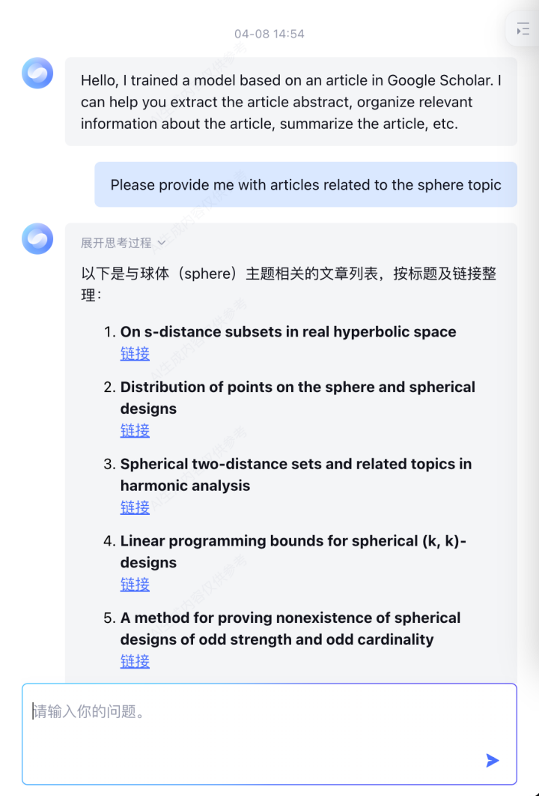
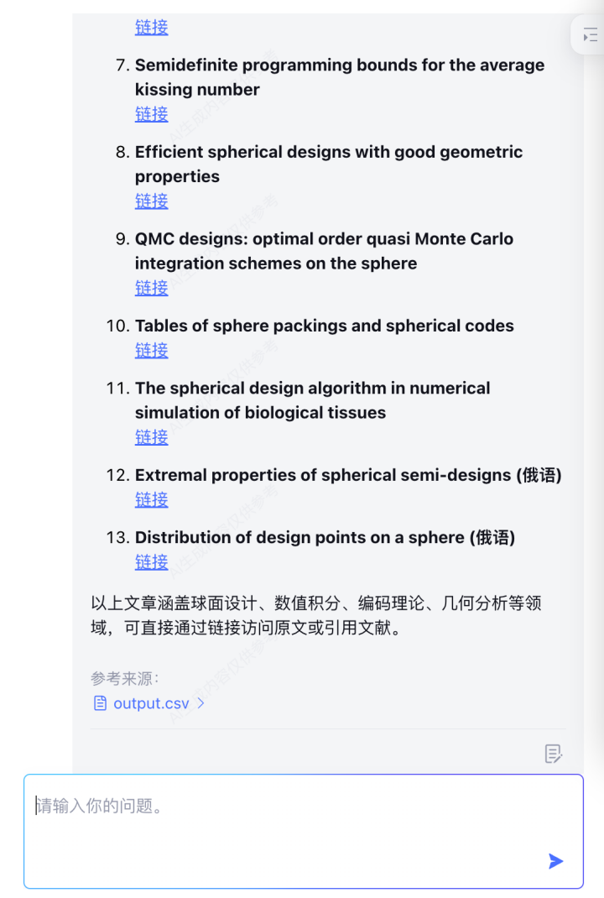
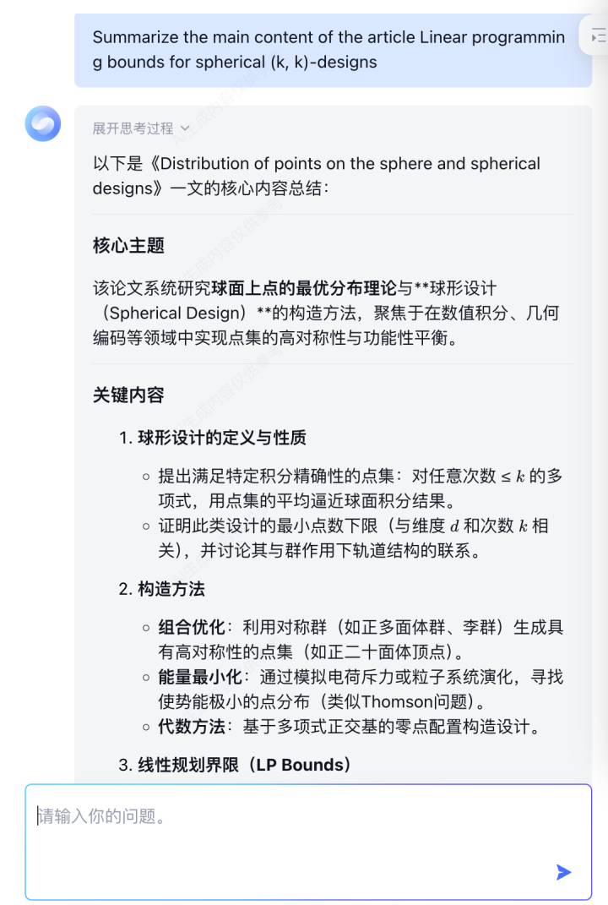
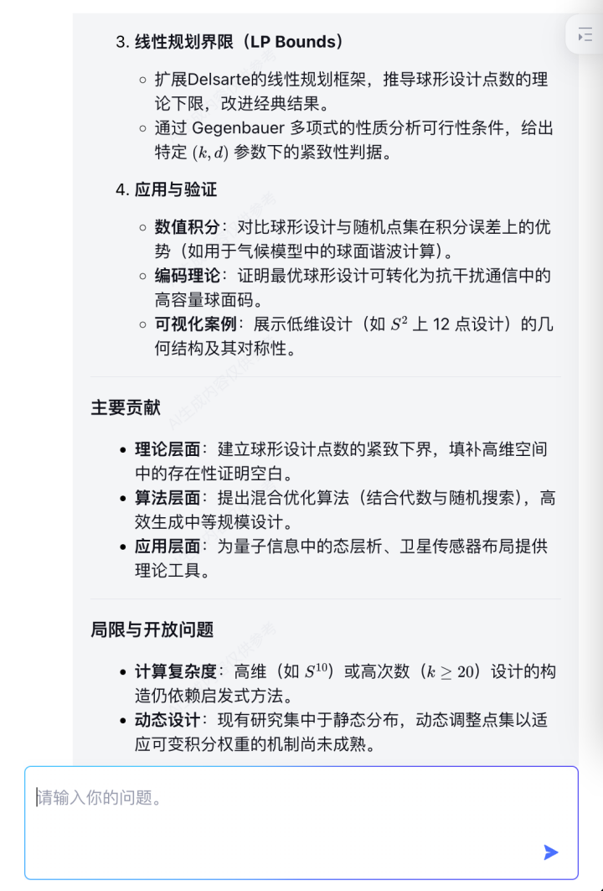
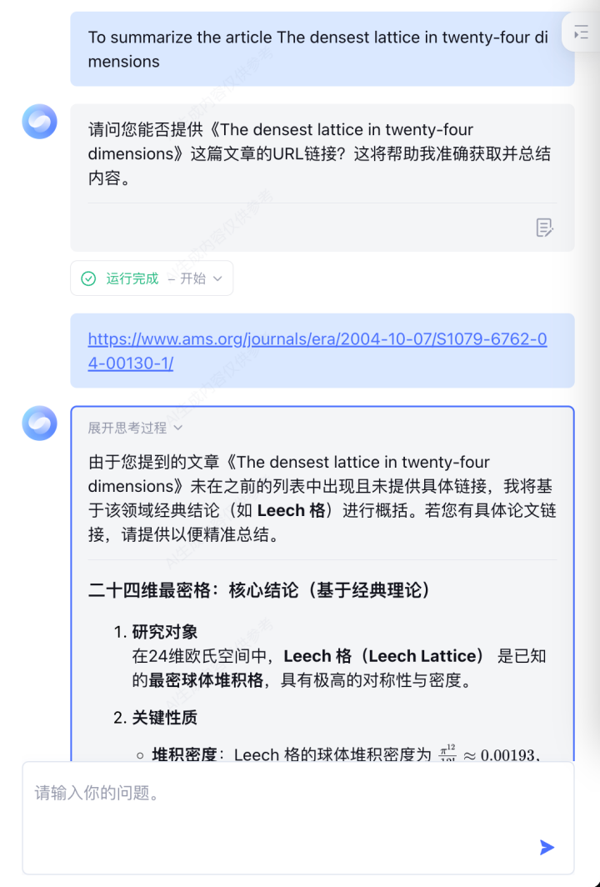
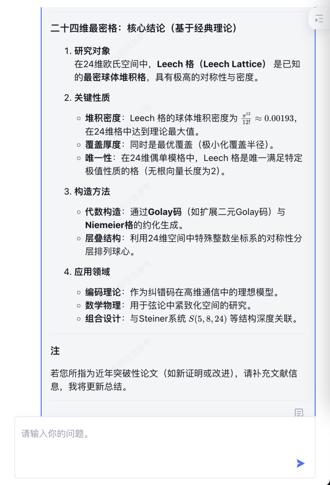
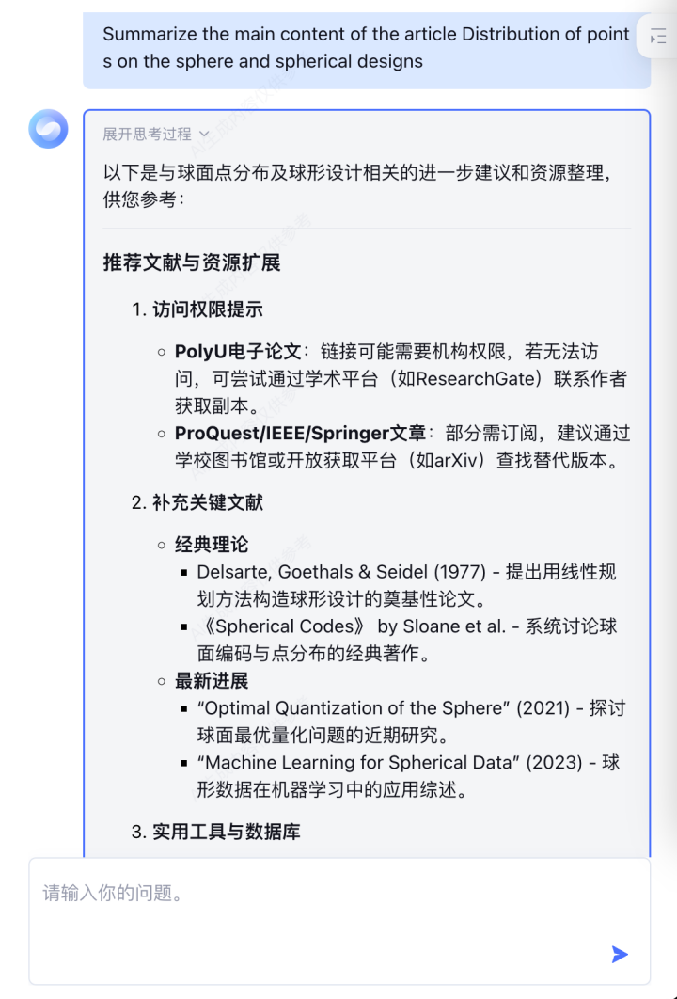
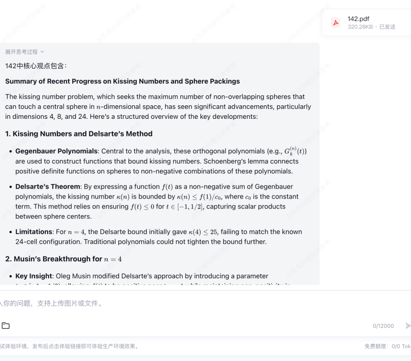
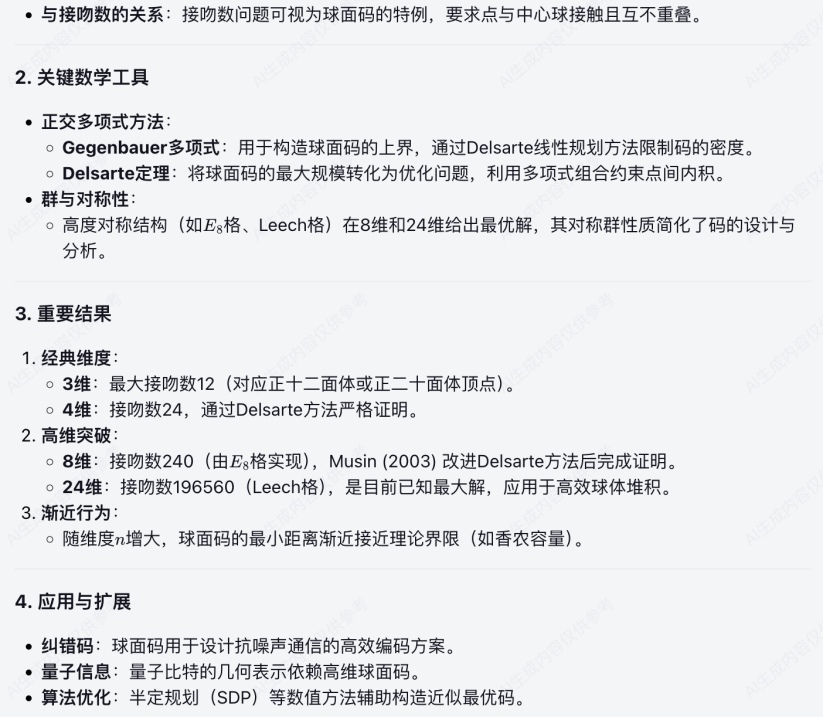
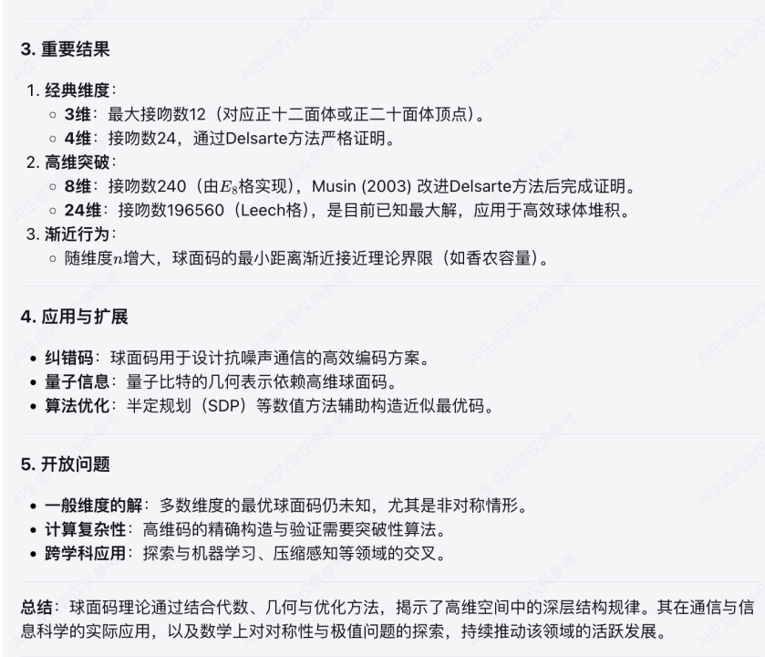

**Chatbot Usage Guide**

**Welcome to Our Chatbot!​**

We're thrilled to have you here! Our Chatbot is designed to be your ultimate research and content - handling companion.​

1. Topic - Related Literature Search​

Need to find academic papers, articles, or reports on a specific topic? Our Chatbot has got you covered. Whether it's for a school project, a work presentation, or just personal curiosity, simply tell the Chatbot your topic, and it will scour through a vast database to provide you with relevant literature sources.​

2. Article Summarization​

Got an interesting article in the form of a URL or a PDF that you don't have time to read in full? No problem. Feed the content to the Chatbot, and it will generate a concise summary, highlighting the key points, main arguments, and important findings. This feature is perfect for quickly grasping the essence of long - form content.​

**EXAMPLE**

if !supportLists1. endifSearch for a topic

If you are interested in a certain topic, such as sphere, combination, etc., you can directly search for relevant subject literature (the literature is in the knowledge base), and the chatbot will provide you with relevant literature based on the topic.

 

 

if !supportLists2. endifSearch for article

If you are interested in an article and want AI to summarize it, you can ask directly.

And If the URL of the article you mentioned has not appeared in the conversation or has been cleared, you need to provide it again.

 

Provide URL:

 

Chatbot does not have direct access to some articles, but you can download and upload the PDF file for access. You don’t need keywords for document analysis and interpretation, just put them into the document.

 

if !supportLists3. endifMake some text output you like

You can ask questions like above, and then have it generate some text output, such as abstracts, introductions, brief introductions to some text, etc. It will help you output papers faster.

